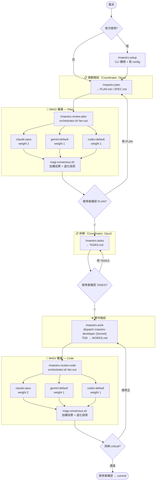

# maestro-workflow

> 多模型協作的軟體工程 workflow plugin（for Claude Code）

讓不同階段使用不同 AI 模型發揮各自所長：Opus 規劃、Gemini + Codex + Opus 並行審議、Sonnet 實作、再用 MAGI 加權投票收斂結果。

## 現在進度

✅ **Phase A–E 全數完成**。Plugin 已 feature-complete，可直接使用。完整路線見 [`SPEC.md`](SPEC.md)。

**核心**
- 多 CLI 並行 fan-out（claude / gemini / codex），事件流協定、quota / auth 自動降級
- MAGI 加權投票 4 種模式（majority / supermajority / unanimous / threshold）
- 6 個核心 slash command：`/maestro.setup`、`/maestro.plan`、`/maestro.tasks`、`/maestro.review-plan`、`/maestro.work`、`/maestro.review-code`
- 2 個 subagent：`maestro-developer`（Sonnet, TDD 實作）、`maestro-reviewer`（Opus, 唯讀審查）
- nvm 相容（避開 `#!/usr/bin/env node` 找錯版本的坑）

**Web 領域 add-ons**
- `/maestro.web.frontend.spec` — 元件樹、a11y checklist、Playwright e2e 計畫
- `/maestro.web.backend.spec` — OpenAPI / SDL 契約、migration、authz 矩陣、contract test
- `/maestro.web.infra.plan` — Terraform plan dry-run、IAM diff、Infracost、rollback
- `/maestro.web.ci.spec` — pipeline 階段、secrets handling、deployment 策略、smoke

**Override flags**
- `--model` / `--magi` / `--reviewers` / `--single` / `--parallel` / `--diff` / `--workdir` / `--milestone` / `--task` / `--reset` / `--recheck`

**團隊化選配**
- `references/AGENTS.md`：跨專案守則的 single source of truth（model routing、coding standards、Conventional Commits、tool preferences、ask-vs-act、SSOT 紀律）
- `hooks/`：可選 git hooks（commit-msg 強制 Conventional Commits、pre-commit 自動跑 lint/typecheck、pre-push WIP 警示），含 `install.sh` 一鍵安裝

## 安裝

### 作為 Claude Code plugin（推薦）

```bash
claude plugin add github:howar31/maestro-workflow
```

安裝後第一件事跑 setup wizard：

```
/maestro.setup
```

它會檢查你機器上的 `claude` / `gemini` / `codex`、詢問你想啟用哪幾位 reviewer 與權重、寫入 `~/.config/maestro-workflow/config.json`，最後跑一次 dry-run 驗證。

### 作為本機開發 / 直接跑 shell scripts

```bash
git clone https://github.com/howar31/maestro-workflow.git /opt/projects/maestro-workflow
cd /opt/projects/maestro-workflow
./scripts/shared/preflight.sh        # 健檢
./test/e2e-smoke.sh                  # 真 CLI 端到端
./test/e2e-fallback.sh               # mock adapter，免 token
```

## 使用流程

### 通用流程

```
/maestro.setup                        # 第一次先跑這個
/maestro.plan "<功能描述>"            # 產出 docs/<num>-<slug>/PLAN.md
/maestro.review-plan                 # 多 CLI MAGI 審 plan
/maestro.tasks                        # 拆 TASKS.md
/maestro.work                         # 派工 maestro-developer 實作
/maestro.review-code                       # 多 CLI MAGI 審 code（--single 退化單審）
                                      # 確認沒問題後手動 commit
```

### Web 領域進階流程（在 `/maestro.plan` 與 `/maestro.tasks` 之間插入）

```
/maestro.plan "<功能描述>"
/maestro.web.frontend.spec            # 補 frontend spec 段落（component / a11y / e2e）
/maestro.web.backend.spec             # 補 backend spec 段落（API contract / migration）
/maestro.web.infra.plan               # 產出 INFRA.md (terraform plan dry-run / IAM diff)
/maestro.web.ci.spec                  # 產出 CI.md + draft workflow YAML
/maestro.review-plan                 # 補完後再 review
/maestro.tasks
/maestro.work
/maestro.review-code
```

每一步都會在使用者面前停下來，等你說「OK 繼續」。Plugin 不會偷偷 commit / push、不會 apply infra、不會 trigger deploy。

## 選配：團隊 Git Hooks

```bash
# 在你想啟用的專案裡：
bash /opt/projects/maestro-workflow/hooks/install.sh

# 或是手動 copy：
cp /opt/projects/maestro-workflow/hooks/{commit-msg,pre-commit,pre-push} .git/hooks/
chmod +x .git/hooks/{commit-msg,pre-commit,pre-push}
```

這會啟用：
- `commit-msg` — 強制 Conventional Commits 格式
- `pre-commit` — 自動偵測並執行專案的 lint / typecheck（pnpm/npm/ruff/mypy/go vet/cargo clippy）
- `pre-push` — WIP / FIXME 警示（不阻擋）

緊急 bypass：`MAESTRO_SKIP_HOOKS=1 git commit ...`

### 環境需求

- macOS 或 Linux（已測試 macOS arm64）
- `bash` 3.2+（macOS 內建即可）
- `jq`、`gtimeout`（建議 `brew install jq coreutils`）
- `claude` CLI（必要）
- `gemini` CLI（選用，需 `GEMINI_API_KEY` env 或登入）
- `codex` CLI（選用）
- nvm + Node 20/22（用 npm-based CLI 時建議）

## 試跑

```bash
# Mock adapter 測試（不耗 token，驗證 fallback 邏輯）
./test/e2e-fallback.sh

# 真實 CLI 測試（每家 reviewer 跑一次 short prompt）
./test/e2e-smoke.sh
```

## 工作流總覽



> 圖中三家 reviewer 是預設配置（claude / gemini / codex）；實際啟用哪幾家、權重多少、required 與否，由 `~/.config/maestro-workflow/config.json` 控制。
>
> Web 領域 add-ons（`/maestro.web.frontend.spec` / `.backend.spec` / `.infra.plan` / `.ci.spec`）插在 `/maestro.plan` 與 `/maestro.tasks` 之間，補強 SPEC.md 的領域段落。

### 外部 CLI reviewer 怎麼跑

每個 reviewer **不是常駐 process，也不是另一個 slash command** — 是 `orchestrator.sh` 在你手動觸發 `/maestro.review-plan` 或 `/maestro.review-code` 那一刻才 spawn 出來的 subprocess：

1. 你打 `/maestro.review-plan`（或 `/maestro.review-code`）
2. Coordinator 讀 `~/.config/maestro-workflow/config.json` 的 `xreview.reviewers` 列表
3. `orchestrator.sh` 平行 spawn 每位啟用的 reviewer：
   - `claude --print "<prompt>"`
   - `nvm exec 22 gemini -p "<prompt>"`
   - `nvm exec 22 codex exec "<prompt>"`
4. 每位 reviewer 獨立跑、互相看不到、各自寫到 `<workdir>/<cli>-<model>.final.txt`
5. 任一位失敗（quota / auth / 真錯誤）→ 標記 SKIP/FAIL，其他繼續
6. 全部完成後，`magi-consensus.sh` 收齊 `.final.txt` + 加權投票 → 產出 `magi-report.md`
7. Coordinator 套 `references/MAGI_VOTING.md` 規則做語意去重 + 最終裁決
8. 結果回給你

換言之，**config 控制的是 fan-out 的「組成」與「失敗策略」，不是「啟動時機」**。沒有 cron、沒有 hook、沒有背景 daemon — 一切從你打那條 slash 開始。

## 角色分工

| 角色 | 模型 | 職責 | 不做 |
|------|------|------|------|
| **Coordinator**（main agent） | Opus（你的 Claude Code session） | 規劃、派工、驗收、文件同步、MAGI 投票收斂 | 不寫 production code |
| **`maestro-developer`** subagent | Sonnet | TDD 實作（紅 → 綠 → 重構）、產出 DONE / BLOCKED 報告 | 不做架構決策、不擴大範圍、不 commit |
| **`maestro-reviewer`** subagent | Opus | 防禦性 code review（`--single` 模式或 MAGI 退化時使用） | 不修改檔案 |
| **外部 CLI**（claude / gemini / codex） | 各家旗艦推理模型 | 多模型並行 review（plan + code 兩道閘門） | 各自獨立、不互相影響、coordinator 用加權投票收斂 |

## 啟用模式（重要）

**每個 slash command 都必須手動輸入 `/maestro.<name>` 才會啟動。** 所有 skill 都帶 `disable-model-invocation: true`，意思是即使你在 plain chat 跟 Claude 說「幫我 plan 一下」，也不會自動觸發 `/maestro.plan`。

設計理由：
- **可預期** — 每次 fan-out 都會花 token、可能改檔，自動觸發風險高
- **顯式優先** — 你想用就用，不想用就閒置
- **可在 chat 裡先聊** — 想清楚要規劃什麼再下 `/maestro.plan`

要切成 LLM 可自動 invoke：移掉 `skills/<name>/SKILL.md` frontmatter 裡的 `disable-model-invocation: true`（每個 skill 各自獨立控制）。

## Config

預設 config 在 `config/default.json`。覆寫請放 `~/.config/maestro-workflow/config.json`。

```jsonc
{
  "xreview": {
    "reviewers": [
      {"cli": "claude", "model": "opus", "weight": 2, "required": true},
      {"cli": "gemini", "model": "default", "weight": 1, "required": false},
      {"cli": "codex",  "model": "default", "weight": 1, "required": false}
    ],
    "magi": {"mode": "majority", "degraded_mode": "warn_user"},
    "fallback_policy": "lenient",
    "min_successful_reviewers": 1
  },
  "node": {"use_nvm": true, "default_version": "22"}
}
```

完整 schema 見 [`SPEC.md`](SPEC.md)。

## 設計守則

- **顯式優先**：所有副作用大的動作都需手動觸發；plugin 不在背後悄悄改檔
- **退化透明**：reviewer 失敗時 MAGI 報告會明確標示「DEGRADED MODE」
- **領域中性**：核心流程（plan / tasks / work / review）不寫死任何技術領域；web 是第一個 add-on
- **不硬綁 Opus 4.7**：用短名 `opus` / `sonnet`，未來換代不需改 plugin

## License

MIT
